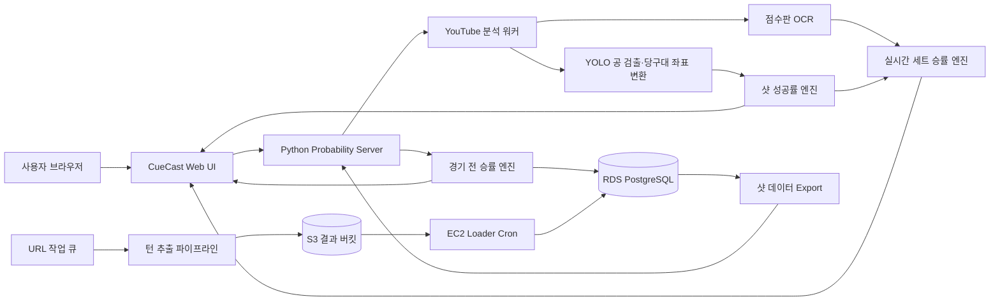

# 26s-w3-c3-01

## 몰입캠프 Week 3 프로젝트 (3인 1팀)

**프로젝트명:** CueCast

**목적:** 3쿠션 당구 중계 영상의 점수판과 공 배치를 분석하고, 선수의 누적 전적과 현재 경기 상태를 결합해 경기 전 승률·실시간 세트 승률·현재 샷 성공률을 제공한다.

**결과물:** YouTube 영상 분석, YOLO 기반 공 좌표 추출, 점수판 OCR, 확률 예측 엔진, PostgreSQL 데이터 파이프라인과 웹 UI가 결합된 3쿠션 당구 분석 서비스

> 경기 전에는 선수 데이터를 비교하고, 경기 중에는 점수와 공격권을 반영하며, 매 샷 직전에는 공 배치 난이도까지 분석하는 실시간 승률 예측 시스템입니다.

---

## 팀원

| 이름 | 학교 | GitHub | 역할 |
|---|---|---|---|
| 박민수 | 한양대학교 | `miinspp` | 영상 턴 추출 파이프라인, 점수판 기반 성공 판정, AWS S3·EC2·RDS 데이터 적재 및 운영 |
| 이지오 | KAIST | `easy0131` | YOLO 당구공 검출, 당구대 좌표 정규화, 정지 배치 추출과 버추얼 당구대 시각화 |
| 손기환 | KAIST | `Kihwan819` | 경기 전·실시간 세트 승률 로직, 샷 성공률 연동, 웹 UI·API·DB 통합 및 문서화 |

> 세 팀원 모두 핵심 로직 구현과 통합 검수에 참여했으며, 화면만 분담하는 방식이 아니라 데이터·모델·서비스 흐름을 함께 연결했습니다.

---

## 핵심 구현 축

- [x] 실시간 인터랙션 — 영상 재생 시점, 점수판, 공 정지 이벤트와 확률 화면을 동기화
- [x] Computer Vision — 당구대와 흰 공·노란 공·빨간 공을 검출해 `0~1` 정규화 좌표 생성
- [x] 데이터 기반 예측 — 선수 전적, 현재 점수·수구, 공 배치를 각각의 확률 엔진에 반영
- [x] Cloud Data Pipeline — 로컬 분석 결과를 S3에 업로드하고 EC2가 RDS에 자동 적재
- [x] Web Service — 실시간 분석, 샷 기록, 선수 통계를 하나의 웹 화면에서 제공

---

## 기획안

- **산출물 주제:** 3쿠션 당구 경기 전·경기 중 승률 및 샷 성공률 예측 서비스
- **제작 목적:** 당구 중계에서 직관적으로 알기 어려운 선수 우위와 공 배치 난이도를 데이터로 설명하고, 경기 흐름에 따라 승률이 바뀌는 과정을 시각화
- **핵심 사용자:** PBA·LPBA 경기 시청자, 데이터 분석 프로젝트 시연자, 당구 경기 기록 분석자
- **핵심 구현 요소:**
  - 2026 시즌 시작 시점의 선수 전적·Elo·최근 흐름·세부 경기력 데이터
  - 경기 전 두 선수의 승률과 주요 우위 요인 비교
  - YouTube 영상 재생과 분석 시점 동기화
  - 점수판 OCR을 통한 현재 점수·공격 선수·득점 성공 판정
  - YOLO와 색상 기반 검출을 통한 공 좌표 및 정지 배치 추출
  - 현재 배치에서의 샷 성공 확률과 난이도·신뢰도 반환
  - 경기 전 승률, 현재 점수, 공격권, 샷 성공률을 결합한 실시간 세트 승률
  - 영상별 턴 데이터를 S3와 PostgreSQL에 축적하는 자동 파이프라인
- **사용 / 시연 시나리오:** 서버 실행 → 선수 선택 → 경기 전 승률 확인 → YouTube URL 입력 → 실시간 분석 시작 → 점수판·공 좌표 인식 → 샷 성공률과 현재 세트 승률 변화 확인 → 샷 기록·선수 통계 조회
- **현재 범위:** 실시간 화면의 승률은 전체 매치가 아닌 **현재 세트 승률**을 표시하며, 선수 이름은 사용자가 DB 선수 목록에서 확정합니다.
- **실행 제약:** 배포 환경에서 YouTube URL 분석과 DB 연동을 하나의 서비스로 함께 실행할 때 접근 거부 오류가 발생했습니다. 따라서 현재 통합 기능은 **로컬 환경에서 서버를 실행하고 SSH 터널로 DB에 연결하는 방식**을 기준으로 검증하고 시연합니다.

### 개발 일정

| 날짜 | 목표 |
|---|---|
| Day 1 | 주제 선정, 데이터 구조와 경기 전·실시간 승률 흐름 설계 |
| Day 2 | 선수 데이터 수집·정제, YOLO 검출기와 당구대 좌표계 구성 |
| Day 3 | 공 정지 이벤트·점수판 OCR·턴 추출 로직 구현 |
| Day 4 | 샷 성공률 엔진과 경기 전 승률 엔진 구현 |
| Day 5 | 실시간 세트 승률 결합, PostgreSQL·S3·EC2 파이프라인 연결 |
| Day 6 | 웹 UI, 선수 검색·통계·샷 기록과 실시간 영상 분석 통합 |
| Day 7 | 예외 처리, 테스트, 배포·시연 점검과 문서 정리 |

---

## 구현 명세서

| 구현 요소 | 설명 | 우선순위 |
|---|---|---|
| 선수 검색·선택 | PBA·LPBA 선수 목록을 DB에서 조회하고 두 선수를 확정 | 필수 |
| 경기 전 승률 | Elo·통산·시즌·최근 흐름·세부 경기력을 신뢰도로 재가중해 계산 | 필수 |
| YouTube 영상 연결 | URL 유효성, 제목, 길이와 재생 위치를 조회하고 분석 세션 생성 | 필수 |
| 점수판 OCR | 현재 점수, 연속 득점, 수구 색과 점수 변화를 읽어 경기 상태 갱신 | 필수 |
| 당구대·공 검출 | 탑뷰 여부를 확인하고 세 공을 검출해 당구대 기준 좌표로 변환 | 필수 |
| 정지 배치 확정 | 세 공이 일정 시간 정지한 경우에만 현재 포메이션을 확정 | 필수 |
| 샷 성공률 | 좌표 모델·근접 과거 배치·Adaptive Grid를 결합해 성공 확률 계산 | 필수 |
| 실시간 세트 승률 | 경기 전 우위, 현재 점수, 공격 선수와 샷 성공률을 결합 | 필수 |
| 샷 기록 | 확정된 정지 배치와 성공률을 시간순으로 저장·표시 | 선택 |
| 선수 통계 | 선수 이미지, Elo, 전적, AVG·TS·BRS·5HS·HR 지표 표시 | 선택 |
| 배치 데이터 수집 | URL 큐를 다운로드·턴 추출·S3 업로드까지 자동 처리 | 필수 |
| DB 자동 적재 | EC2 cron이 S3 결과를 RDS PostgreSQL에 upsert | 필수 |
| Chrome 확장 UI | 동일 확률 정보를 브라우저 사이드패널 형태로 확인 | 선택 |

상세 요구사항과 검증 기준은 [기능 명세서](docs/functional-spec.md)에서 확인할 수 있습니다.

---

## 아키텍처

- **브라우저**는 YouTube 재생, 선수 선택, 확률·점수판·버추얼 당구대 표시를 담당합니다.
- **Python 서버**는 UI, REST API, 영상 분석 워커와 세 종류의 확률 계산을 한 프로세스에서 연결합니다.
- **YOLO·OCR 파이프라인**은 현재 공 좌표와 점수 상태를 만들며, 확정되지 않은 배치는 학습·기록 데이터로 사용하지 않습니다.
- **RDS PostgreSQL**은 선수 전적과 과거 샷 데이터를 저장하고, S3는 영상별 추출 결과와 export 파일을 중계합니다.
- 로컬 데모에서는 `run_cuecast_local.sh`가 EC2를 경유하는 SSH 터널을 열어 RDS에 접근합니다.
- 배포 서버에서 YouTube 영상 요청과 RDS 연결을 동시에 수행하면 접근 거부가 발생할 수 있어, 현재 검증된 통합 실행 경로는 `사용자 로컬 → YouTube 분석 → EC2 SSH 터널 → RDS`입니다.

전체 배포·운영 구조는 [배포 가이드](docs/DEPLOYMENT.md), 배치 추출 흐름은 [파이프라인 개요](docs/PIPELINE_OVERVIEW.md)를 참고합니다.

---

## 설계 문서

### 화면 / 인터페이스 설계

| 화면 | 목적 | 주요 행동 |
|---|---|---|
| 실시간 분석 | YouTube 영상과 현재 확률을 함께 확인 | URL 입력, 선수 선택, 분석 시작·정지·동기화 |
| 영상·점수판 영역 | 재생 위치와 OCR 경기 상태 확인 | 영상 이동, 점수 확인, 선수명 수정, 점수 초기화 |
| 샷 성공률 패널 | 현재 확정 배치의 성공 가능성 확인 | 성공률·난이도·신뢰도·주요 이유 확인 |
| 버추얼 당구대 | 흰 공·노란 공·빨간 공 좌표 시각화 | 수구 기준 전환, 포메이션 확인 |
| 실시간 세트 승률 | 현재 점수와 수구를 반영한 세트 우위 확인 | 두 선수 승률·게이지·경기 전 승률 비교 |
| 샷 기록 | 확정된 포메이션 분석 이력 조회 | 이전 샷 성공률과 배치 확인 |
| 선수 통계 | 선수별 전적과 세부 지표 조회 | 리그·선수 선택, 통계·이미지 확인 |
| 확장 프로그램 | YouTube 옆에서 간단한 분석 정보 확인 | 서버 연결, 최신 분석 결과 조회 |

상세 화면 상태와 전환 조건은 [화면 설계서](docs/screen-design.md)를 참고합니다.

### 데이터 구조
