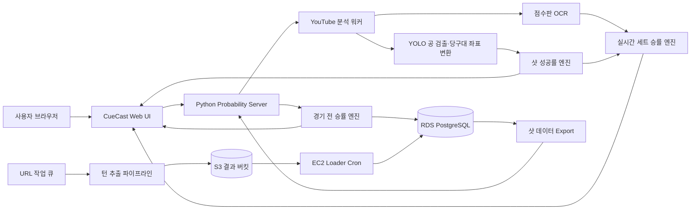

# 26s-w3-c3-01

## 몰입캠프 Week 3 프로젝트 (3인 1팀)

**프로젝트명:** CueCast

**목적:** 3쿠션 당구 중계 영상의 점수판과 공 배치를 분석하고, 선수의 누적 전적과 현재 경기 상태를 결합해 경기 전 승률·실시간 세트 승률·현재 샷 성공률을 제공한다.

**결과물:** YouTube 영상 분석, YOLO 기반 공 좌표 추출, 점수판 OCR, 확률 예측 엔진, PostgreSQL 데이터 파이프라인과 웹 UI가 결합된 3쿠션 당구 분석 서비스

> 경기 전에는 선수 데이터를 비교하고, 경기 중에는 점수와 공격권을 반영하며, 매 샷 직전에는 공 배치 난이도까지 분석하는 실시간 승률 예측 시스템입니다.

---

## 팀원

| 이름 | 학교 | GitHub | 역할 |
|---|---|---|---|
| 박민수 | 한양대학교 | `miinspp` | 영상 턴 추출 파이프라인, 점수판 기반 성공 판정, AWS S3·EC2·RDS 데이터 적재 및 운영 |
| 이지오 | KAIST | `easy0131` | YOLO 당구공 검출, 당구대 좌표 정규화, 정지 배치 추출과 버추얼 당구대 시각화 |
| 손기환 | KAIST | `Kihwan819` | 경기 전·실시간 세트 승률 로직, 샷 성공률 연동, 웹 UI·API·DB 통합 및 문서화 |

> 세 팀원 모두 핵심 로직 구현과 통합 검수에 참여했으며, 화면만 분담하는 방식이 아니라 데이터·모델·서비스 흐름을 함께 연결했습니다.

---

## 핵심 구현 축

- [x] 실시간 인터랙션 — 영상 재생 시점, 점수판, 공 정지 이벤트와 확률 화면을 동기화
- [x] Computer Vision — 당구대와 흰 공·노란 공·빨간 공을 검출해 `0~1` 정규화 좌표 생성
- [x] 데이터 기반 예측 — 선수 전적, 현재 점수·수구, 공 배치를 각각의 확률 엔진에 반영
- [x] Cloud Data Pipeline — 로컬 분석 결과를 S3에 업로드하고 EC2가 RDS에 자동 적재
- [x] Web Service — 실시간 분석, 샷 기록, 선수 통계를 하나의 웹 화면에서 제공

---

## 기획안

- **산출물 주제:** 3쿠션 당구 경기 전·경기 중 승률 및 샷 성공률 예측 서비스
- **제작 목적:** 당구 중계에서 직관적으로 알기 어려운 선수 우위와 공 배치 난이도를 데이터로 설명하고, 경기 흐름에 따라 승률이 바뀌는 과정을 시각화
- **핵심 사용자:** PBA·LPBA 경기 시청자, 데이터 분석 프로젝트 시연자, 당구 경기 기록 분석자
- **핵심 구현 요소:**
  - 2026 시즌 시작 시점의 선수 전적·Elo·최근 흐름·세부 경기력 데이터
  - 경기 전 두 선수의 승률과 주요 우위 요인 비교
  - YouTube 영상 재생과 분석 시점 동기화
  - 점수판 OCR을 통한 현재 점수·공격 선수·득점 성공 판정
  - YOLO와 색상 기반 검출을 통한 공 좌표 및 정지 배치 추출
  - 현재 배치에서의 샷 성공 확률과 난이도·신뢰도 반환
  - 경기 전 승률, 현재 점수, 공격권, 샷 성공률을 결합한 실시간 세트 승률
  - 영상별 턴 데이터를 S3와 PostgreSQL에 축적하는 자동 파이프라인
- **사용 / 시연 시나리오:** 서버 실행 → 선수 선택 → 경기 전 승률 확인 → YouTube URL 입력 → 실시간 분석 시작 → 점수판·공 좌표 인식 → 샷 성공률과 현재 세트 승률 변화 확인 → 샷 기록·선수 통계 조회
- **현재 범위:** 실시간 화면의 승률은 전체 매치가 아닌 **현재 세트 승률**을 표시하며, 선수 이름은 사용자가 DB 선수 목록에서 확정합니다.
- **실행 제약:** 배포 환경에서 YouTube URL 분석과 DB 연동을 하나의 서비스로 함께 실행할 때 접근 거부 오류가 발생했습니다. 따라서 현재 통합 기능은 **로컬 환경에서 서버를 실행하고 SSH 터널로 DB에 연결하는 방식**을 기준으로 검증하고 시연합니다.

### 개발 일정

| 날짜 | 목표 |
|---|---|
| Day 1 | 주제 선정, 데이터 구조와 경기 전·실시간 승률 흐름 설계 |
| Day 2 | 선수 데이터 수집·정제, YOLO 검출기와 당구대 좌표계 구성 |
| Day 3 | 공 정지 이벤트·점수판 OCR·턴 추출 로직 구현 |
| Day 4 | 샷 성공률 엔진과 경기 전 승률 엔진 구현 |
| Day 5 | 실시간 세트 승률 결합, PostgreSQL·S3·EC2 파이프라인 연결 |
| Day 6 | 웹 UI, 선수 검색·통계·샷 기록과 실시간 영상 분석 통합 |
| Day 7 | 예외 처리, 테스트, 배포·시연 점검과 문서 정리 |

---

## 구현 명세서

| 구현 요소 | 설명 | 우선순위 |
|---|---|---|
| 선수 검색·선택 | PBA·LPBA 선수 목록을 DB에서 조회하고 두 선수를 확정 | 필수 |
| 경기 전 승률 | Elo·통산·시즌·최근 흐름·세부 경기력을 신뢰도로 재가중해 계산 | 필수 |
| YouTube 영상 연결 | URL 유효성, 제목, 길이와 재생 위치를 조회하고 분석 세션 생성 | 필수 |
| 점수판 OCR | 현재 점수, 연속 득점, 수구 색과 점수 변화를 읽어 경기 상태 갱신 | 필수 |
| 당구대·공 검출 | 탑뷰 여부를 확인하고 세 공을 검출해 당구대 기준 좌표로 변환 | 필수 |
| 정지 배치 확정 | 세 공이 일정 시간 정지한 경우에만 현재 포메이션을 확정 | 필수 |
| 샷 성공률 | 좌표 모델·근접 과거 배치·Adaptive Grid를 결합해 성공 확률 계산 | 필수 |
| 실시간 세트 승률 | 경기 전 우위, 현재 점수, 공격 선수와 샷 성공률을 결합 | 필수 |
| 샷 기록 | 확정된 정지 배치와 성공률을 시간순으로 저장·표시 | 선택 |
| 선수 통계 | 선수 이미지, Elo, 전적, AVG·TS·BRS·5HS·HR 지표 표시 | 선택 |
| 배치 데이터 수집 | URL 큐를 다운로드·턴 추출·S3 업로드까지 자동 처리 | 필수 |
| DB 자동 적재 | EC2 cron이 S3 결과를 RDS PostgreSQL에 upsert | 필수 |
| Chrome 확장 UI | 동일 확률 정보를 브라우저 사이드패널 형태로 확인 | 선택 |

상세 요구사항과 검증 기준은 [기능 명세서](docs/functional-spec.md)에서 확인할 수 있습니다.

---

## 아키텍처



- **브라우저**는 YouTube 재생, 선수 선택, 확률·점수판·버추얼 당구대 표시를 담당합니다.
- **Python 서버**는 UI, REST API, 영상 분석 워커와 세 종류의 확률 계산을 한 프로세스에서 연결합니다.
- **YOLO·OCR 파이프라인**은 현재 공 좌표와 점수 상태를 만들며, 확정되지 않은 배치는 학습·기록 데이터로 사용하지 않습니다.
- **RDS PostgreSQL**은 선수 전적과 과거 샷 데이터를 저장하고, S3는 영상별 추출 결과와 export 파일을 중계합니다.
- 로컬 데모에서는 `run_cuecast_local.sh`가 EC2를 경유하는 SSH 터널을 열어 RDS에 접근합니다.
- 배포 서버에서 YouTube 영상 요청과 RDS 연결을 동시에 수행하면 접근 거부가 발생할 수 있어, 현재 검증된 통합 실행 경로는 `사용자 로컬 → YouTube 분석 → EC2 SSH 터널 → RDS`입니다.

전체 배포·운영 구조는 [배포 가이드](docs/DEPLOYMENT.md), 배치 추출 흐름은 [파이프라인 개요](docs/PIPELINE_OVERVIEW.md)를 참고합니다.

---

## 설계 문서

### 화면 / 인터페이스 설계

| 화면 | 목적 | 주요 행동 |
|---|---|---|
| 실시간 분석 | YouTube 영상과 현재 확률을 함께 확인 | URL 입력, 선수 선택, 분석 시작·정지·동기화 |
| 영상·점수판 영역 | 재생 위치와 OCR 경기 상태 확인 | 영상 이동, 점수 확인, 선수명 수정, 점수 초기화 |
| 샷 성공률 패널 | 현재 확정 배치의 성공 가능성 확인 | 성공률·난이도·신뢰도·주요 이유 확인 |
| 버추얼 당구대 | 흰 공·노란 공·빨간 공 좌표 시각화 | 수구 기준 전환, 포메이션 확인 |
| 실시간 세트 승률 | 현재 점수와 수구를 반영한 세트 우위 확인 | 두 선수 승률·게이지·경기 전 승률 비교 |
| 샷 기록 | 확정된 포메이션 분석 이력 조회 | 이전 샷 성공률과 배치 확인 |
| 선수 통계 | 선수별 전적과 세부 지표 조회 | 리그·선수 선택, 통계·이미지 확인 |
| 확장 프로그램 | YouTube 옆에서 간단한 분석 정보 확인 | 서버 연결, 최신 분석 결과 조회 |

상세 화면 상태와 전환 조건은 [화면 설계서](docs/screen-design.md)를 참고합니다.

### 데이터 구조

| 스키마 / 테이블 | 역할 |
|---|---|
| `public.billiard_turns` | 영상에서 추출한 샷 직전·직후 공 좌표와 성공 라벨 |
| `public.billiard_ingest_log` | 영상 단위 DB 적재 이력 |
| `cuecast.player_master` | 2026 서비스용 선수 마스터와 이미지 메타데이터 |
| `cuecast.player_runtime_state` | 2026 개막 직전 Elo·통산·최근·세부 경기력 스냅샷 |
| `cuecast.season_player_state` | 2026 시즌 진행에 따라 갱신되는 선수 누적 상태 |
| `cuecast.matches` | 과거 및 2026 시즌 경기 결과 |
| `cuecast.player_match_detail_stats` | 선수별 경기 세부 기록 |
| `prematch_*` | 경기 전 승률 API가 빠르게 조회하는 서비스용 투영 테이블 |

세부 컬럼, 관계와 중복 스키마의 역할은 [DB 스키마 문서](docs/database-schema.md)를 참고합니다.

### API / 외부 서비스 연동

| Method / 방식 | Endpoint / 서비스 | 설명 |
|---|---|---|
| REST | `GET /api/v1/health` | 모델·데이터·경기 전 DB 연결 상태 확인 |
| REST | `GET /api/v1/prematch/players` | PBA·LPBA 선수 목록 조회 |
| REST | `POST /api/v1/match-probability` | 경기 전 두 선수 승률 계산 |
| REST | `POST /api/v1/shot-probability` | 현재 세 공 좌표의 샷 성공률 계산 |
| REST | `POST /api/v1/youtube/live/start` | YouTube 실시간 분석 시작 |
| REST | `GET /api/v1/detection/latest` | 최신 확정 공 배치·샷 확률·점수판 조회 |
| REST | `GET /api/v1/live-match-probability/latest` | 최신 실시간 세트 승률 조회 |
| SDK / CLI | `yt-dlp`, FFmpeg | YouTube 영상 정보 조회·다운로드·프레임 처리 |
| ML / CV | Ultralytics YOLO, OpenCV, Tesseract | 공 검출, 좌표 변환, 점수판 OCR |
| Cloud | AWS S3·EC2·RDS | 추출 결과 중계, 자동 적재, 데이터 저장 |

전체 endpoint의 요청·응답과 오류 형식은 [API 명세서](docs/api-spec.md)를 참고합니다.

### 확률 모델

- **경기 전 승률:** Elo 30%, 통산 17.5%, 현재 시즌 5%, 최근 흐름 2.5%, 세부 경기력 45%를 데이터 신뢰도로 재가중
- **샷 성공률:** 연속 좌표 모델, 유사 과거 배치, Adaptive Grid를 데이터 양과 좌표 오차에 따라 결합
- **실시간 세트 승률:** 경기 전 승률에서 얻은 선수 기본 능력과 현재 점수·공격권·현재 샷 성공률을 결합

세부 계산은 [경기 전 승률 문서](docs/PREMATCH_PROBABILITY.md)와 [샷 성공률 모델 문서](YOLO/PROBABILITY_MODEL.md)를 참고합니다.

---

## 산출물 및 실행 방법

- **산출물 설명:** Python 기반 영상 분석·확률 서버와 정적 웹 UI, PostgreSQL 데이터베이스, AWS 자동 적재 파이프라인
- **실행 환경:** macOS 권장, Python 3.11 또는 3.12, OpenCV 4.x, FFmpeg, yt-dlp, PostgreSQL 및 **별도 설치된 Tesseract 실행 프로그램**
- **기본 접속 주소:** `http://127.0.0.1:8765`
- **시연 이미지:** 추후 `docs/images/` 또는 README 상단에 실시간 분석 화면, 선수 비교 화면, 시스템 아키텍처 이미지를 추가

### 필수 시스템 프로그램 설치

Python 패키지만 설치해서는 점수판 OCR이 동작하지 않습니다. 운영체제에 **Tesseract 실행 프로그램**을 별도로 설치하고 `PATH`에서 실행 가능해야 합니다.

| 운영체제 | 설치 예시 |
|---|---|
| macOS | `brew install tesseract ffmpeg` |
| Ubuntu / Debian | `sudo apt-get update && sudo apt-get install -y tesseract-ocr ffmpeg` |
| Windows | Tesseract 설치 후 설치 폴더를 `PATH`에 추가하고 FFmpeg도 별도 설치 |

설치 확인:

```bash
tesseract --version
ffmpeg -version
```

Tesseract가 인식되지 않으면 점수판 OCR, 공격권 판정과 점수 변화 기반 실시간 승률 계산이 정상적으로 진행되지 않습니다.

### 로컬 실행

```bash
# 저장소 루트
cd 26s-w3-c3-01

# 가상환경과 의존성
python3.12 -m venv venv
source venv/bin/activate
python -m pip install --upgrade pip
pip install -r requirements.txt
pip install -r YOLO/requirements.txt

# CueCast 실행
./run_cuecast_local.sh
```

`run_cuecast_local.sh`는 다음 작업을 순서대로 수행합니다.

1. EC2에서 최신 `billiard_turns_export.jsonl`을 가져옵니다.
2. `YOLO/.env`의 `DATABASE_URL`을 사용해 RDS SSH 터널을 준비합니다.
3. 샷 성공률 모델과 경기 전 승률 서비스를 로드합니다.
4. 시스템 `PATH`에서 Tesseract와 FFmpeg를 확인합니다.
5. `http://127.0.0.1:8765`에서 웹 UI와 API를 실행합니다.

### 현재 실행 및 배포 제약

- 현재 완전히 검증된 실행 방식은 `run_cuecast_local.sh`를 사용하는 로컬 실행입니다.
- 배포 환경에서 YouTube URL을 이용한 영상 접근과 DB 연동을 동시에 수행할 때 접근 거부 오류가 발생해, 웹에 배포된 단일 서버만으로 전체 기능을 제공하지 못했습니다.
- 접근 거부의 세부 원인은 실행 환경의 네트워크 정책, YouTube 요청 제한, DB 보안 그룹 또는 자격증명 설정에 따라 달라질 수 있습니다.
- 발표와 기능 검증에서는 로컬 분석 서버와 EC2 SSH 터널을 통해 RDS를 연결합니다.
- Tesseract는 pip 패키지가 아니라 운영체제 프로그램이므로 배포 환경에도 실행 파일과 `PATH` 설정이 별도로 필요합니다.

### 영상 데이터 수집 파이프라인

```bash
echo "https://www.youtube.com/watch?v=XXXX" > jobs/pending/demo.txt
source db/db.env
venv/bin/python src/process_queue.py
```

처리 결과는 `results/<video_id>/`에 생성되고 S3에 업로드됩니다. EC2 loader가 주기적으로 RDS에 적재합니다.

### 품질 검증

```bash
venv/bin/python -m unittest discover -s tests -v
venv/bin/python -m unittest discover -s YOLO/tests -v
bash deploy/verify_pipeline.sh
```

### 필수 환경변수

`YOLO/.env`:

```env
DATABASE_URL=postgresql://<user>:<password>@localhost:15432/<database>
```

`db/db.env`:

```env
S3_BUCKET=<bucket-name>
AWS_REGION=ap-northeast-2
DATABASE_URL=postgresql://<user>:<password>@<rds-host>:5432/<database>
```

선택 환경변수:

```env
CUECAST_SSH_ALIAS=billiard
CUECAST_RDS_HOST=<rds-host>
CUECAST_TUNNEL_PORT=15432
YTDLP_COOKIES=<cookies-file>
```

> 실제 DB 비밀번호, AWS 자격증명, 쿠키와 모델 외부 경로는 저장소에 커밋하지 않습니다.

### 기술 구성

| 분류 | 사용 기술 |
|---|---|
| 영상·Computer Vision | Python, OpenCV, Ultralytics YOLO, Tesseract OCR |
| 확률 모델 | CatBoost, Logistic Regression, 유사 배치 가중치, Adaptive Grid |
| 서버·API | Python `ThreadingHTTPServer`, JSON REST API |
| 웹 UI | HTML, CSS, JavaScript, YouTube IFrame API |
| 데이터베이스 | PostgreSQL, psycopg2 |
| Cloud | AWS S3, EC2, RDS, IAM, cron |
| 수집·미디어 | yt-dlp, FFmpeg |
| 테스트·협업 | unittest, GitHub, Shell Script |

---
## 회고 문서

### Keep — 잘 된 점, 다음에도 유지할 것

- 경기 전 승률, 실시간 세트 승률, 샷 성공률을 분리된 모듈로 구현해 각 입력과 책임이 명확했습니다.
- 점수판 변화만 성공 라벨로 사용하고, 좌표 검출 품질과 성공 판정을 분리해 학습 데이터의 신뢰도를 높였습니다.
- 캠퍼스망 제약을 S3 443 포트와 EC2 내부 적재, 로컬 SSH 터널로 우회해 실제 동작하는 데이터 파이프라인을 완성했습니다.
- 영상 분석 결과뿐 아니라 원인·난이도·신뢰도와 선수별 세부 지표를 함께 보여 주도록 구성했습니다.

### Problem — 아쉬웠던 점, 개선이 필요한 것

- 방송사·대회별 점수판 모양과 카메라 구도가 달라 OCR과 당구대 검출이 특정 영상 형식에 의존합니다.
- 서버 시작 시 모델 학습과 영상 분석이 CPU 자원을 많이 사용해 저사양 EC2에서는 실시간성이 떨어질 수 있습니다.
- 현재 실시간 화면은 전체 매치 승률이 아니라 현재 세트 승률이며, 세트 간 누적 상태를 완전히 자동 복원하지 않습니다.
- `cuecast.*` 원본·운영 테이블과 `prematch_*` 서비스용 투영 테이블이 함께 있어 데이터 갱신 책임을 명확히 관리해야 합니다.
- 배포 환경에서 YouTube URL 분석과 DB 연동을 함께 시도하면 접근 거부 오류가 발생해, 현재 전체 기능은 로컬 서버에서만 안정적으로 가동할 수 있습니다.
- 점수판 OCR을 위해 Tesseract 실행 프로그램을 별도로 설치해야 하므로, Python 의존성 설치만으로 실행 환경이 완성되지 않습니다.

### Try — 다음번에 시도해볼 것

- 방송 템플릿별 점수판 영역 자동 선택과 OCR 신뢰도 보정
- 신규 경기 적재 후 선수 Elo·최근 기록·모델을 자동 갱신하는 학습 파이프라인
- 세트 스코어까지 추적해 현재 세트 승률을 전체 경기 승률로 확장
- 더 많은 실제 샷 데이터와 좌표 증강을 이용한 모델 교정·캘리브레이션
- 분석 지연, OCR 실패율, 검출 누락률을 수집하는 운영 모니터링 추가
- YouTube 접근 전용 워커와 DB API를 분리하거나 프록시·큐 구조를 도입해 배포 환경의 접근 거부 문제 해결
- Tesseract와 FFmpeg를 포함한 컨테이너 이미지 또는 자동 설치 스크립트로 실행 환경 표준화

---

## 참고 자료

### 프로젝트 문서

- [기능 명세서](docs/functional-spec.md)
- [DB 스키마 문서](docs/database-schema.md)
- [화면 설계서](docs/screen-design.md)
- [API 명세서](docs/api-spec.md)
- [시스템 전체 구성·배포 가이드](docs/DEPLOYMENT.md)
- [데이터 계약](docs/DATA_CONTRACT.md)
- [턴 추출 판정 기준](docs/EXTRACTION_CRITERIA.md)
- [파이프라인 개요](docs/PIPELINE_OVERVIEW.md)
- [경기 전 승률 계산](docs/PREMATCH_PROBABILITY.md)
- [샷 성공률 모델](YOLO/PROBABILITY_MODEL.md)

### 추가할 이미지

- README 상단: CueCast 로고와 실시간 분석 대표 화면
- 주요 기능: 경기 전 선수 비교 화면
- 아키텍처: 브라우저 → 분석 서버 → YOLO·OCR → 확률 엔진 → AWS 구조도
- 데이터 구조: 선수 통계·경기 기록·샷 데이터 관계도
- 결과 화면: 실시간 세트 승률 변화와 버추얼 당구대
