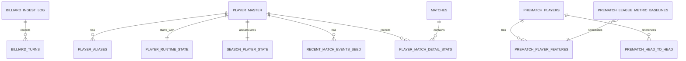

# CueCast DB 스키마 문서

## 1. 문서 개요

CueCast의 PostgreSQL 데이터는 목적에 따라 세 영역으로 나뉩니다.

1. **영상 샷 데이터:** `public.billiard_turns`, `public.billiard_ingest_log`
2. **2026 선수 원본·운영 데이터:** `cuecast.*`
3. **경기 전 승률 서비스용 투영 데이터:** `prematch_*`

`cuecast.*`는 원본 CSV 구조와 시즌 갱신을 보존하는 상세 데이터 계층이고, `prematch_*`는 경기 전 확률 API가 필요한 값을 빠르게 조회하도록 정리한 서비스 계층입니다. 두 계층을 같은 의미의 중복 원본으로 취급하지 않습니다.

현재 통합 서비스는 로컬 CueCast 서버가 EC2 SSH 터널을 통해 RDS에 접근하는 방식으로 검증했습니다. 배포 환경에서 YouTube URL 분석과 DB 연동을 동시에 실행할 때 접근 거부가 발생했으므로, RDS를 인터넷에 직접 공개하는 방식은 사용하지 않습니다.

---

## 2. 전체 관계



### 2.1 데이터 흐름

```text
영상 → turns.jsonl → S3 → public.billiard_turns → export JSONL → 샷 성공률 모델

final_dataset_2026_start CSV
  ├─ db/load_players_dataset.py → cuecast.* 상세 테이블
  └─ db/import_prematch_dataset.py → prematch_* 서비스 테이블
                                      ↓
                              경기 전 승률 API
```

---

## 3. `public` 영상 샷 데이터

### 3.1 `public.billiard_turns`

한 행은 한 영상의 한 턴 또는 샷을 의미합니다.

| 컬럼 | 타입 | Null | 설명 |
|---|---|---:|---|
| `video_id` | `TEXT` | N | YouTube 영상 식별자 |
| `turn` | `INT` | N | 영상 안의 턴 순번 |
| `epoch` | `INT` | Y | 탑뷰 연속 구간 번호 |
| `shooter` | `TEXT` | Y | 수구 색상, 서비스 기준 `white` 또는 `yellow` |
| `success` | `BOOLEAN` | Y | 3쿠션 득점 성공 여부 |
| `success_method` | `TEXT` | Y | 적재 데이터 기준 `scoreboard` |
| `coverage` | `REAL` | Y | 샷 구간 수구 관측 비율 |
| `cushions_before_2nd` | `INT` | Y | 두 번째 목적구 전 쿠션 수, QA용 |
| `bank_shot` | `BOOLEAN` | Y | 점수 +2 뱅크샷 여부 |
| `hits` | `JSONB` | Y | 접촉 순서 추정, QA용 |
| `before_pos` | `JSONB` | N | 샷 직전 세 공 좌표 |
| `after_pos` | `JSONB` | N | 샷 이후 세 공 좌표 |
| `after_source` | `TEXT` | Y | 좌표 출처 |
| `frame_start` | `INT` | Y | 시작 프레임 |
| `frame_end` | `INT` | Y | 종료 프레임 |
| `time_start_s` | `REAL` | Y | 영상 시작 시간, 초 |
| `time_end_s` | `REAL` | Y | 영상 종료 시간, 초 |
| `loaded_at` | `TIMESTAMPTZ` | N | DB 적재 시간 |

**Primary Key:** `(video_id, turn)`

**Indexes:**

- `idx_billiard_turns_video(video_id)`
- `idx_billiard_turns_shooter(shooter)`
- `idx_billiard_turns_success(success)`

#### 좌표 JSON 예시

```json
{
  "white": [0.66, 0.24],
  "yellow": [0.68, 0.29],
  "red": [0.11, 0.13]
}
```

#### 무결성 규칙

- `before_pos`, `after_pos`에는 세 공이 모두 있어야 합니다.
- 좌표는 당구대 좌상단을 원점으로 하는 `0~1` 정규화 값입니다.
- 범위 밖 좌표는 추출 단계 또는 로더에서 제외합니다.
- 학습 및 운영 적재는 점수판으로 성공 여부를 판정한 턴만 사용합니다.
- `schema.sql`의 오래된 주석이나 허용 값보다 `load_to_db.py`와 `EXTRACTION_CRITERIA.md`의 scoreboard-only 정책을 우선합니다.

### 3.2 `public.billiard_ingest_log`

| 컬럼 | 타입 | 설명 |
|---|---|---|
| `video_id` | `TEXT PK` | 적재한 영상 식별자 |
| `n_turns` | `INT` | 적재한 턴 수 |
| `loaded_at` | `TIMESTAMPTZ` | 마지막 적재 시간 |

영상 단위 적재 완료 여부와 결과 행 수를 확인하는 운영 로그입니다.

---

## 4. `cuecast` 선수 상세 데이터

### 4.1 `cuecast.player_master`

선수 식별자, 이름, 리그와 이미지 메타데이터를 저장합니다.

| 주요 컬럼 | 설명 |
|---|---|
| `player_code` | 선수 고유 코드, PK |
| `league` | `PBA` 또는 `LPBA` |
| `player_name`, `player_name_short` | 정식 이름과 UI 축약 이름 |
| `active_2026_roster` | 2026 시즌 활성 명단 여부 |
| `has_prior_career_stats` | 과거 통산 데이터 존재 여부 |
| `image_file`, `image_url` | 로컬 상대경로 또는 원본 URL |
| `image_is_placeholder` | 실제 선수 이미지 여부 판별 |
| `master_source` | 마스터 생성 출처 |

### 4.2 `cuecast.player_aliases`

OCR 이름이나 다양한 표기를 선수 코드에 연결합니다.

| 키 | 설명 |
|---|---|
| PK | `(player_code, alias)` |
| `normalized_alias` | 공백·기호·대소문자를 정리한 비교용 이름 |
| `alias_source` | 별칭 생성 출처 |

### 4.3 `cuecast.player_runtime_state`

2026 시즌 시작 직전의 선수별 고정 스냅샷입니다.

주요 데이터 묶음:

- `elo_start`, `elo_matches_prior`
- 통산 경기·승·패와 보정 승률
- 최근 5경기·10경기 보정 승률과 coverage
- 과거 상세 기록 이닝 수와 신뢰도
- `AVG`, `TS`, `BRS`, `5HS`, `HR` 원본·축소 추정값
- 표준화 z-score와 `performance_q_start`
- 2026 시즌 시작값과 최종 결합 지표

**Primary Key:** `player_code`

### 4.4 `cuecast.league_metric_baselines`

선수 세부 경기력 표준화를 위한 리그별 평균과 표준편차입니다.

**Primary Key:** `(league, metric)`

사용 지표:

- `AVG`
- `TS`
- `BRS`
- `5HS`
- `HR`

### 4.5 `cuecast.recent_match_events_seed`

2026 시즌 개막 시 최근 경기 rolling window를 시작하기 위한 과거 이벤트입니다.

**Primary Key:** `(league, player_code, recent_rank)`

최근 경기 날짜, 상대, 결과, 대회와 라운드를 보존합니다.

### 4.6 `cuecast.head_to_head_reference`

두 선수의 과거 상대 전적을 저장합니다.

**Primary Key:** `(player_a_code, player_b_code)`

`included_in_final_probability`는 현재 모델에서 상대 전적이 최종 확률에 포함되는지를 명시합니다. 현재 경기 전 모델에서는 참고 표시만 하므로 `false`가 원칙입니다.

### 4.7 `cuecast.season_player_state`

2026 시즌 경기 결과가 들어올 때 계속 갱신되는 mutable 선수 상태입니다.

주요 컬럼:

- `elo_current`, `elo_matches_total`
- 시즌 경기·승·패와 보정 승률
- 누적 이닝, AVG
- 전체 시도·성공, TS
- 브레이크 시도·성공, BRS
- 5점 이상 샷, 5HS
- 최고 연속 득점, HR
- 최근 상세 경기 최대 5개 집계 상태

**Primary Key:** `player_code`

### 4.8 `cuecast.matches`

과거 경기와 2026 시즌 경기를 통합 저장합니다.

| 주요 컬럼 | 설명 |
|---|---|
| `match_uid` | 경기 고유 ID, PK |
| `league`, `season_code` | 리그와 시즌 |
| `tournament_*`, `round_*` | 대회와 라운드 |
| `player1_code`, `player2_code` | 두 선수 코드 |
| `player1_set_score`, `player2_set_score` | 최종 세트 스코어 |
| `winner_code`, `loser_code` | 승자·패자 |
| `is_walkover`, `is_played` | 부전승과 실제 경기 여부 |
| `model_eligible` | 모델 입력 사용 가능 여부 |

### 4.9 `cuecast.player_match_detail_stats`

한 경기의 선수 한 명 기준 세부 기록입니다.

**Primary Key:** `(match_uid, player_code)`

주요 기록:

- 세트별 득점 `pts_by_set`
- 득점 `pts`, 이닝 `inn`, 평균 `avg`, 최고 연속 득점 `high_run`
- 전체 시도·성공과 성공률
- 5점 이상 샷 수와 비율
- 브레이크 시도·성공과 성공률
- `mapping_status`, `identity_match_method`, `mapping_score`

`mapping_status`가 불명확하거나 원본 점수 합이 맞지 않는 기록은 점수 관련 컬럼을 `NULL` 처리하거나 모델 대상에서 제외해야 합니다.

---

## 5. `prematch_*` 서비스용 투영 데이터

현재 `PostgresPrematchRepository`는 이 테이블을 직접 조회합니다. 따라서 경기 전 API 운영에는 `prematch_*` 적재가 필요합니다.

### 5.1 `prematch_players`

| 컬럼 | 설명 |
|---|---|
| PK | `(league, player_code)` |
| `player_name`, `player_name_short` | UI 검색 이름 |
| `active_roster` | 활성 선수 필터 |
| `image_*` | 이미지 바이너리와 MIME 타입 |
| `image_is_placeholder` | 대체 이미지 여부 |

### 5.2 `prematch_player_features`

최신 시점별 경기 전 계산용 스냅샷입니다.

| 데이터 | 컬럼 |
|---|---|
| 식별 | `snapshot_at`, `league`, `season_code`, `player_code` |
| Elo | `elo` |
| 통산 | `career_matches`, `career_wins` |
| 시즌 | `season_matches`, `season_wins` |
| 최근 | `last5_*`, `last10_*` |
| 경기력 | `performance_score`, `performance_innings_total`, `metrics JSONB` |

**Primary Key:** `(snapshot_at, league, player_code)`

서비스는 같은 선수·리그·시즌에서 가장 최근 `snapshot_at`을 사용합니다.

### 5.3 `prematch_head_to_head`

두 선수의 상대 전적 참고 정보입니다.

**Primary Key:** `(league, player_a_code, player_b_code)`

최종 확률에는 반영하지 않고 화면 설명에만 사용합니다.

### 5.4 `prematch_league_metric_baselines`

지표 표준화 기준을 시점별로 저장합니다.

**Primary Key:** `(snapshot_at, league, metric)`

---

## 6. 스키마 간 매핑

| `cuecast` 원본·운영 | `prematch` 서비스 |
|---|---|
| `player_master` | `prematch_players` |
| `player_runtime_state` + `season_player_state` | `prematch_player_features` |
| `head_to_head_reference` | `prematch_head_to_head` |
| `league_metric_baselines` | `prematch_league_metric_baselines` |

### 권장 갱신 순서
