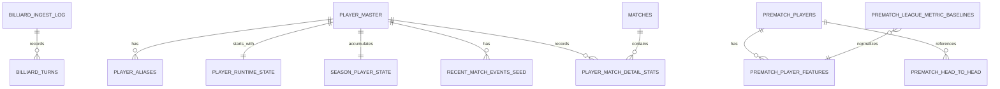

# CueCast DB 스키마 문서

## 1. 문서 개요

CueCast의 PostgreSQL 데이터는 목적에 따라 세 영역으로 나뉩니다.

1. **영상 샷 데이터:** `public.billiard_turns`, `public.billiard_ingest_log`
2. **2026 선수 원본·운영 데이터:** `cuecast.*`
3. **경기 전 승률 서비스용 투영 데이터:** `prematch_*`

`cuecast.*`는 원본 CSV 구조와 시즌 갱신을 보존하는 상세 데이터 계층이고, `prematch_*`는 경기 전 확률 API가 필요한 값을 빠르게 조회하도록 정리한 서비스 계층입니다. 두 계층을 같은 의미의 중복 원본으로 취급하지 않습니다.

현재 통합 서비스는 로컬 CueCast 서버가 EC2 SSH 터널을 통해 RDS에 접근하는 방식으로 검증했습니다. 배포 환경에서 YouTube URL 분석과 DB 연동을 동시에 실행할 때 접근 거부가 발생했으므로, RDS를 인터넷에 직접 공개하는 방식은 사용하지 않습니다.

---

## 2. 전체 관계



### 2.1 데이터 흐름

```text
영상 → turns.jsonl → S3 → public.billiard_turns → export JSONL → 샷 성공률 모델

final_dataset_2026_start CSV
  ├─ db/load_players_dataset.py → cuecast.* 상세 테이블
  └─ db/import_prematch_dataset.py → prematch_* 서비스 테이블
                                      ↓
                              경기 전 승률 API
```

---

## 3. `public` 영상 샷 데이터

### 3.1 `public.billiard_turns`

한 행은 한 영상의 한 턴 또는 샷을 의미합니다.

| 컬럼 | 타입 | Null | 설명 |
|---|---|---:|---|
| `video_id` | `TEXT` | N | YouTube 영상 식별자 |
| `turn` | `INT` | N | 영상 안의 턴 순번 |
| `epoch` | `INT` | Y | 탑뷰 연속 구간 번호 |
| `shooter` | `TEXT` | Y | 수구 색상, 서비스 기준 `white` 또는 `yellow` |
| `success` | `BOOLEAN` | Y | 3쿠션 득점 성공 여부 |
| `success_method` | `TEXT` | Y | 적재 데이터 기준 `scoreboard` |
| `coverage` | `REAL` | Y | 샷 구간 수구 관측 비율 |
| `cushions_before_2nd` | `INT` | Y | 두 번째 목적구 전 쿠션 수, QA용 |
| `bank_shot` | `BOOLEAN` | Y | 점수 +2 뱅크샷 여부 |
| `hits` | `JSONB` | Y | 접촉 순서 추정, QA용 |
| `before_pos` | `JSONB` | N | 샷 직전 세 공 좌표 |
| `after_pos` | `JSONB` | N | 샷 이후 세 공 좌표 |
| `after_source` | `TEXT` | Y | 좌표 출처 |
| `frame_start` | `INT` | Y | 시작 프레임 |
| `frame_end` | `INT` | Y | 종료 프레임 |
| `time_start_s` | `REAL` | Y | 영상 시작 시간, 초 |
| `time_end_s` | `REAL` | Y | 영상 종료 시간, 초 |
| `loaded_at` | `TIMESTAMPTZ` | N | DB 적재 시간 |
