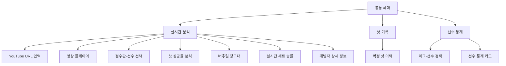

# CueCast 화면 설계서

## 1. 문서 개요

CueCast 웹 UI는 하나의 서버에서 제공되는 단일 페이지 애플리케이션입니다. 상단 탭을 통해 실시간 분석, 샷 기록과 선수 통계를 이동하며, 분석 상태는 polling API로 갱신합니다.

현재 전체 통합 화면은 로컬 CueCast 서버에서 실행하는 것을 기준으로 합니다. 배포 환경에서 YouTube URL 분석과 DB 연동을 동시에 사용할 때 접근 거부가 발생했으며, 점수판 OCR을 사용하려면 로컬 운영체제에 Tesseract 실행 프로그램이 설치되어 있어야 합니다.

### 1.1 화면 설계 원칙

- 영상과 핵심 확률을 같은 시야 안에 배치합니다.
- 확정된 데이터와 잠정·대기 데이터를 문구와 상태 색으로 구분합니다.
- 확률만 표시하지 않고 난이도, 신뢰도와 영향 요인을 함께 제공합니다.
- 선수 이름은 OCR 추정값을 그대로 확정하지 않고 DB 검색 결과를 사용합니다.
- 작은 화면에서는 점수판과 확률 영역을 세로로 재배치합니다.

---

## 2. 전체 정보 구조



---

## 3. 공통 헤더

### 구성 요소

| 요소 | 설명 | 상태 |
|---|---|---|
| CueCast 로고 | 홈 또는 실시간 분석 화면으로 이동 | 항상 표시 |
| 실시간 분석 탭 | 영상·점수·확률 화면 | 기본 선택 |
| 샷 기록 탭 | 확정 배치 분석 이력 | 데이터 없으면 빈 상태 |
| 선수 통계 탭 | DB 선수 기록 조회 | DB 미연결 시 안내 |
| 엔진 상태 | 서버 연결 여부 | 회색: 대기, 초록: 연결 |

### 동작

- 탭 전환은 페이지 새로고침 없이 수행합니다.
- 서버 health 요청 실패 시 엔진 연결 상태를 오류로 표시합니다.
- 로고·탭·버튼은 키보드 포커스를 표시합니다.

---

## 4. 실시간 분석 화면

### 4.1 YouTube URL 입력 바

| 항목 | 설명 |
|---|---|
| URL 입력 | YouTube 영상 링크 입력 |
| 연결 버튼 | 영상 정보 조회 후 플레이어 로드 |
| 분석 시작 | 현재 재생 위치부터 실시간 분석 시작 |
| 분석 중지 | 워커 중지 |
| 동기화 | 브라우저 재생 위치를 서버 분석 위치에 반영 |

#### 상태

- 초기: URL 입력 안내
- 확인 중: 영상 정보 조회
- 연결 완료: 제목·길이 확인, 플레이어 표시
- 분석 중: 워커 상태 polling
- 오류: URL·다운로드·분석 실패, 원격 환경 접근 거부 또는 Tesseract 미설치 사유 표시

### 4.2 영상 플레이어

- 16:9 비율을 유지합니다.
- 영상 미연결 시 빈 상태와 사용 안내를 표시합니다.
- 우측 상단 overlay에 현재 샷 성공률과 분석 상태를 표시합니다.
- 사용자가 seek하면 서버 분석 위치와 차이가 생길 수 있으므로 동기화 동작을 제공합니다.

### 4.3 점수판·선수 선택 영역

```text
[선수 A 검색]  [점수 A]  VS  [점수 B]  [선수 B 검색]
                     연속 득점 / 편집·초기화
```

#### 선수 검색

- `/api/v1/prematch/players`의 선수 목록을 사용합니다.
- 화면에는 `shortName`을 우선 표시할 수 있지만 서버 전달에는 정식 `name`을 사용합니다.
- 목록 선택 후 해당 이름을 현재 분석 세션에만 유지합니다.
- 두 선수 중 하나라도 미확정이면 실시간 세트 승률은 waiting 상태입니다.

#### 점수 표시

- OCR 결과의 `player1Score`, `player2Score`를 표시합니다.
- 부분 OCR은 이전 정상 값과 병합됩니다.
- 세트 전환·오류 시 점수 초기화 버튼으로 점수와 run만 비웁니다.
- 선수 선택은 점수 초기화로 삭제하지 않습니다.

### 4.4 샷 성공률 분석 패널

| 요소 | 설명 |
|---|---|
| 현재 샷 성공률 | `successProbability`를 백분율로 표시 |
| 분석 상태 | 대기, 이동 중, 정지 확정, 재계산, 오류 |
| 난이도 | 확률 구간 또는 모델 산출 난이도 |
| 신뢰도 | 데이터 수·이웃 거리·좌표 민감도를 반영 |
| 모델 근거 | 유사 배치, Grid, 좌표 모델의 영향 |
| 경고 | 데이터 부족, 수구 잠정, 좌표 오차가 큰 경우 |

확률 숫자는 확정된 정지 배치에서만 샷 기록에 저장합니다. 이동 중 잠정값은 화면 보조용으로만 사용합니다.

### 4.5 버추얼 당구대

- 실제 당구대 장·단축 비율을 유지합니다.
- 흰 공·노란 공·빨간 공을 색상으로 표시합니다.
- 현재 수구에는 `수구` 라벨을 표시합니다.
- 좌표는 당구대 기준 `left=x`, `top=y` 백분율로 렌더링합니다.
- 현재 배치와 직전 확정 배치를 구분할 수 있도록 상태를 함께 표시합니다.

### 4.6 실시간 세트 승률

```text
실시간 세트 승률 예측          [계산 상태]

선수 A 57.3%   ━━━━━━━━━━━   42.7% 선수 B

경기 전 승률
선수 A 61.0%                선수 B 39.0%
```

#### 표시 규칙

- 제목에 **세트 승률**을 명시합니다.
- `setWinProbabilityA`와 B의 보수를 표시합니다.
- 계산 중에는 직전 확정값을 유지하되 `재계산 중` 상태를 표시할 수 있습니다.
- 선수 선택 직후에는 점수·배치가 없어도 경기 전 승률 박스를 표시합니다.
- 점수 또는 수구가 바뀌면 이전 샷 기반 실시간 승률은 즉시 확정값으로 간주하지 않습니다.

### 4.7 개발자 상세 정보

접을 수 있는 상세 영역으로 다음을 제공합니다.

- 데이터 레코드 수
- 모델·엔진 버전
- 좌표 모델, 유사 배치, Grid 구성 확률
- 좌표 오차와 반복 예측 결과
- 원시 JSON 또는 분석 메타데이터
- 현재 데이터 소스

일반 사용 흐름을 방해하지 않도록 기본적으로 접힌 상태로 둡니다.

---

## 5. 샷 기록 화면

### 목적

사용자가 현재 분석 세션에서 확정된 정지 배치와 샷 성공률 변화를 되돌아봅니다.

### 기록 조건

- `analysis.layoutSource === "stopped"`
- 새로운 `confirmedVersion`
- 세 공 좌표와 샷 확률 존재
- 이동 중·잠정·중복 배치 제외

### 카드 구성

| 요소 | 설명 |
|---|---|
| 순번 / 시각 | 세션 안의 기록 순서와 영상 시점 |
| 수구 | 흰 공 또는 노란 공 |
| 성공률 | 확정 당시 샷 성공률 |
| 난이도·신뢰도 | 당시 모델 설명 |
| 미니 당구대 | 세 공 배치 |
| 점수판 | 기록 당시 점수가 있으면 함께 표시 |

### 빈 상태

- 아직 확정된 샷이 없음을 설명합니다.
- 실시간 분석 탭에서 영상 연결과 분석 시작 방법을 안내합니다.

---

## 6. 선수 통계 화면

### 검색·필터

| 요소 | 설명 |
|---|---|
| 리그 | PBA / LPBA |
| 선수 검색 | 정식 이름과 축약 이름 |
| 활성 선수만 | 기본 true |
| 선수 이미지 | DB 이미지 또는 이름 기반 대체 아바타 |

### 통계 카드

- Elo
- 통산 경기, 승, 패와 승률
- 2026 시즌 경기, 승, 패
- 최근 5경기·10경기
- AVG
- TS
- BRS
- 5HS
- HR
- 세부 경기력 종합 점수

### 데이터 없음

- DB 연결 실패와 해당 선수 통계 없음은 다른 메시지로 구분합니다.
- 실제 이미지가 없을 때 placeholder 여부를 표시하거나 기본 아바타를 사용합니다.

---

## 7. 확장 프로그램 화면

### 목적

YouTube 페이지 옆 사이드패널에서 CueCast 서버의 최신 분석 결과를 간단히 확인합니다.

### 구성

- 서버 URL 또는 연결 상태
- 현재 샷 성공률
- 수구와 세 공 미니 배치
- 점수판 요약
- 최신 업데이트 시간
- 메인 웹 UI 열기

`/extension-preview`는 브라우저 확장 설치 전 화면 검증용입니다.

---

## 8. 상태 정의

| 상태 | 의미 | UI 처리 |
|---|---|---|
| `idle` | 영상 또는 분석이 시작되지 않음 | 입력 안내 |
| `starting` | 워커 준비 중 | spinner, 버튼 비활성 |
| `running` | 프레임 분석 중 | 진행 상태와 중지 버튼 |
| `waiting` | 필수 입력 일부 부족 | 부족한 항목 문구 |
| `ready` | 최신 계산 완료 | 확률·게이지 표시 |
| `pending` | 새 배치 또는 재계산 대기 | 직전 값 유지 가능 |
| `stopped` | 사용자가 분석 중지 | 재시작 안내 |
| `error` | 서버·영상·DB·모델·OCR 오류 | 접근 거부, Tesseract 미설치 등 원인 문구와 재시도 동작 |

---

## 9. 반응형 설계

### 데스크톱

- 영상 영역과 분석 패널을 2:1 비율의 2열로 표시합니다.
- 점수판은 한 줄에 선수·점수·액션을 배치합니다.

### 태블릿 / 모바일

- 영상과 분석 패널을 세로 1열로 전환합니다.
- 점수판 선수 검색과 액션을 여러 줄로 배치합니다.
- 확률 숫자와 현재 점수는 축약하지 않고 우선 표시합니다.
- 개발자 상세 정보는 기본 접힘을 유지합니다.

---

## 10. 접근성 및 오류 문구 원칙

- 색상만으로 성공·오류를 구분하지 않고 텍스트를 함께 표시합니다.
- 버튼에는 현재 동작을 설명하는 명확한 문구를 사용합니다.
- polling 중 화면 전체를 막지 않고 변경되는 영역만 갱신합니다.
- OCR 결과가 불확실한 경우 확정된 사실처럼 표현하지 않습니다.
- 전체 경기 승률과 현재 세트 승률을 혼용하지 않습니다.
- 입력 오류는 가능한 한 해당 입력 근처에 표시합니다.
- YouTube 또는 DB 접근 거부는 단순한 URL 형식 오류와 구분해 안내합니다.
- Tesseract 실행 파일을 찾지 못한 경우 `tesseract --version` 확인과 설치 필요성을 안내합니다.
- 원격 배포에서 전체 기능을 사용할 수 있다고 오해하지 않도록 현재 공식 실행 환경이 로컬임을 실행 안내에 표시합니다.

---

## 11. 추가 이미지 계획
