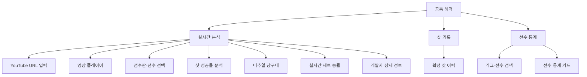

# CueCast 화면 설계서

## 1. 문서 개요

CueCast 웹 UI는 하나의 서버에서 제공되는 단일 페이지 애플리케이션입니다. 상단 탭을 통해 실시간 분석, 샷 기록과 선수 통계를 이동하며, 분석 상태는 polling API로 갱신합니다.

현재 전체 통합 화면은 로컬 CueCast 서버에서 실행하는 것을 기준으로 합니다. 배포 환경에서 YouTube URL 분석과 DB 연동을 동시에 사용할 때 접근 거부가 발생했으며, 점수판 OCR을 사용하려면 로컬 운영체제에 Tesseract 실행 프로그램이 설치되어 있어야 합니다.

### 1.1 화면 설계 원칙

- 영상과 핵심 확률을 같은 시야 안에 배치합니다.
- 확정된 데이터와 잠정·대기 데이터를 문구와 상태 색으로 구분합니다.
- 확률만 표시하지 않고 난이도, 신뢰도와 영향 요인을 함께 제공합니다.
- 선수 이름은 OCR 추정값을 그대로 확정하지 않고 DB 검색 결과를 사용합니다.
- 작은 화면에서는 점수판과 확률 영역을 세로로 재배치합니다.

---

## 2. 전체 정보 구조

---

## 3. 공통 헤더

### 구성 요소

| 요소 | 설명 | 상태 |
|---|---|---|
| CueCast 로고 | 홈 또는 실시간 분석 화면으로 이동 | 항상 표시 |
| 실시간 분석 탭 | 영상·점수·확률 화면 | 기본 선택 |
| 샷 기록 탭 | 확정 배치 분석 이력 | 데이터 없으면 빈 상태 |
| 선수 통계 탭 | DB 선수 기록 조회 | DB 미연결 시 안내 |
| 엔진 상태 | 서버 연결 여부 | 회색: 대기, 초록: 연결 |

### 동작

- 탭 전환은 페이지 새로고침 없이 수행합니다.
- 서버 health 요청 실패 시 엔진 연결 상태를 오류로 표시합니다.
- 로고·탭·버튼은 키보드 포커스를 표시합니다.

---

## 4. 실시간 분석 화면

### 4.1 YouTube URL 입력 바

| 항목 | 설명 |
|---|---|
| URL 입력 | YouTube 영상 링크 입력 |
| 연결 버튼 | 영상 정보 조회 후 플레이어 로드 |
| 분석 시작 | 현재 재생 위치부터 실시간 분석 시작 |
| 분석 중지 | 워커 중지 |
| 동기화 | 브라우저 재생 위치를 서버 분석 위치에 반영 |

#### 상태
